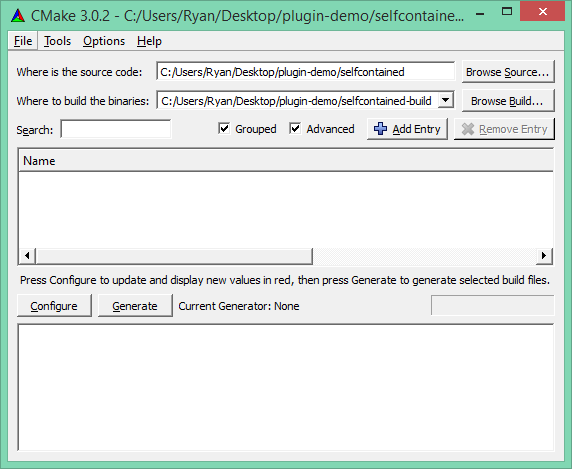
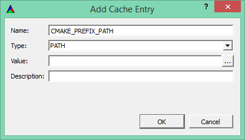
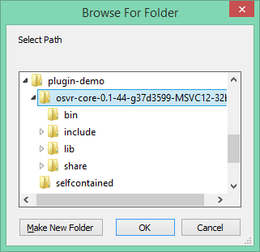
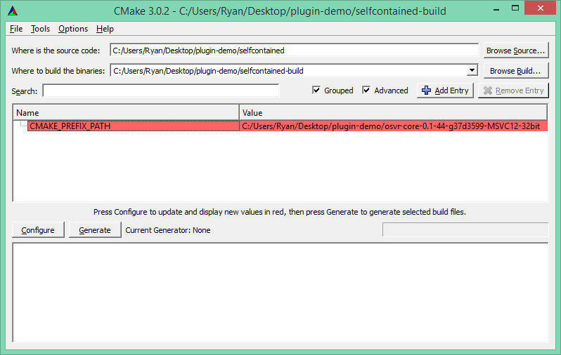
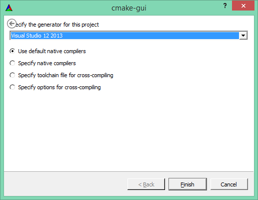

# Writing a basic device plugin              {#TopicWritingDevicePlugin}

Writing a device plugin means you'll be building against the [PluginKit](@ref PluginKit) library, which presents a C API, as well as some C++ header-only wrappers. The API does not impose a required structure, so you can more easily integrate it with an existing driver codebase. However, the following steps can help you build a plugin from scratch.

1. Make a copy of the directory `/examples/plugin/selfcontained` as the starting point for your new plugin repository.

   This assumes that your plugin will be "out-of-tree"—that is, not hosted in the main OSVR-Core repository.

2. Follow the instructions in the `EXAMPLE_PLUGIN_README.md` file to change the plugin name and set up the build system.

3. Implement a hardware detection callback (to determine if your device is connected):

   This can take the form of a class with a function call operator (`operator()`), taking an @ref OSVR_PluginRegContext parameter named `ctx` and returning an @ref OSVR_ReturnCode value. The sample plugin source includes an example of this.

4. From within your callback, if the device exists, create a device token (as seen in the sample, or as in the `DummySync` examples). You need to have your device hold on to the device token to send data with it later on.

5. The guts of implementing a device start at about line 51 of the sample: wait until there is data then call @ref osvrDeviceSendData. (There are two versions of this function: one where you provide a timestamp, and one where the timestamp is automatically created for you.) Your device may have different types of sensors (e.g., tracker, button, analog) and you will need to use appropriate interfaces for each to send reports from device in your plugin.

6. Create device descriptor JSON and name it `com_VendorName_DeviceName.json`. You can either use the sample JSON descriptor and modify it according to you needs or use the [Device Descriptor Editor](http://opengoggles.org/) to create the JSON descriptor. For each interface (e.g., tracker, button, analog), you will need to describe its semantics—that is, assign useful names to analog channels, etc.). The device descriptor's purpose is to tell the OSVR server what kind of sensors your device has. Specifying the device vendor and the product name in device descriptor file is for informational purposes.

Note that these instructions are only for drivers that can fully self-configure. Manually-configured drivers are also possible, but no minimal sample has yet been created. You essentially take the same steps as in an auto-detected plugin, except instead of registering a hardware detection callback, you call @ref osvrRegisterDriverInstantiationCallback providing a name for your driver and a function pointer. The function you provide will be called by the server and passed a JSON string of configuration data if the user configures your plugin in the `osvr_server` config file.

For auto-configured drivers, you should remove the `"driver"` section from the `osvr_server_config.json` file, otherwise it will try to load name of specific driver and you would get an error similar to:

    [OSVR Server] - com_example_MyDevice/DeviceName No driver initialization callback was registered for the driver name DeviceName

## Building Your Plugin

These are instructions for Windows and Visual Studio, but they follow similarly for other platforms.

1. *Prepare source and dependencies:* Unzip a build snapshot somewhere convenient, and ensure your plugin resides outside of the snatpshot's directory tree.

   

2. *Set the source and build directories:* Open CMake, and set the source directory and build directory. It is usually best to build in a separate directory from the source directory. This keeps the source directory clean and free of generated files.

   

3. *Add the dependency locations to the `CMAKE_PREFIX_PATH` variable:* Click the "Add Entry" button. Enter `CMAKE_PREFIX_PATH` as the name and choose `PATH` as the type. Then, click the "..." button to open a folder selection window.

   

   Select the root directory of the snapshot—this is the folder that contains `bin`, `lib`, etc. Then click OK to confirm the directory, and OK again to complete adding the entry.

   

   You'll end up back at the main screen, which now looks like this:

   

4. *Configure and generate the build scripts and project files:* Click the "Configure" button. If the build directory you specified doesn't yet exist, CMake will ask for confirmation before creating it. CMake will now search for any required library dependencies and header files.

   

   Next, select the appropriate build system or project version for your system. In Windows, you will likely want to select your version of Visual Studio; under Linux, select Makefile. Click Finish to return to the main window. Finally, click Generate to generate the build script or project solution files.

   

5. *Open the project:* In the build directory you specified, CMake will have generated a `.sln` solution file for you if you are using Visual Studio. Double-click to open the project in Visual Studio, and build your plugin. Note that your snapshot may only have a limited subset of the build configurations included (typically Debug and RelWithDebInfo), so building your plugin in other configurations may not work.

6. *Locate your compiled plugin files:* You will find the compiled plugin `.dll` file in a subdirectory of build directory named according to the build type (e.g., `Debug`, `Release`).

   

## Testing your plugin

In order for the OSVR server to properly load the plugin and find your device, you will need to create a new `osvr_server_config.json` file. You can start by modifying an existing config file and changing the configuration appropriately. You will need to add routes to `osvr_server_config.json` file for sensors that you specified in your device descriptor.

Once your plugin loads succesfully, you can view the data that the OSVR server is transmitting from your plugin. The `vrpn_print_devices` utility will display this information:

    vrpn_print_devices org_example_MyDevice/DeviceName@localhost

You can find the proper device name when you run the `osvr_server`. After successfully loading your plugin, the server will print a message similar to:

    Added device org_example_MyDevice/DeviceName

Here is some example output from a tracker device:

    vrpn_print_devices com_osvr_Vuzix/Vuzix@localhost
    Opened com_osvr_Vuzix/Vuzix@localhost as: Tracker Button Analog Dial Text
    Press ^C to exit.
    Tracker com_osvr_Vuzix/Vuzix@localhost, sensor 0:
            pos ( 0.00,  0.00,  0.00); quat (-0.08,  0.89, -0.05,  0.45)
    Tracker com_osvr_Vuzix/Vuzix@localhost, sensor 0:
            pos ( 0.00,  0.00,  0.00); quat (-0.12,  0.78,  0.03,  0.87)
    Tracker com_osvr_Vuzix/Vuzix@localhost, sensor 0:
            pos ( 0.00,  0.00,  0.00); quat (-0.12,  0.48,  0.03,  0.87)
    Tracker com_osvr_Vuzix/Vuzix@localhost, sensor 0:
            pos ( 0.00,  0.00,  0.00); quat (-0.12, -0.88,  0.03,  0.46)

