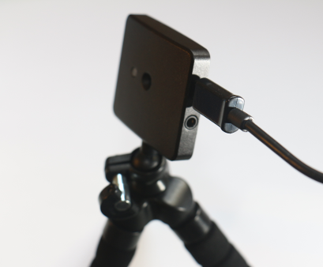
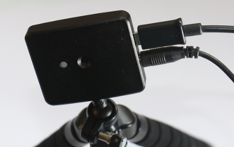
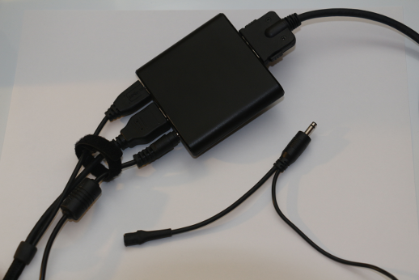
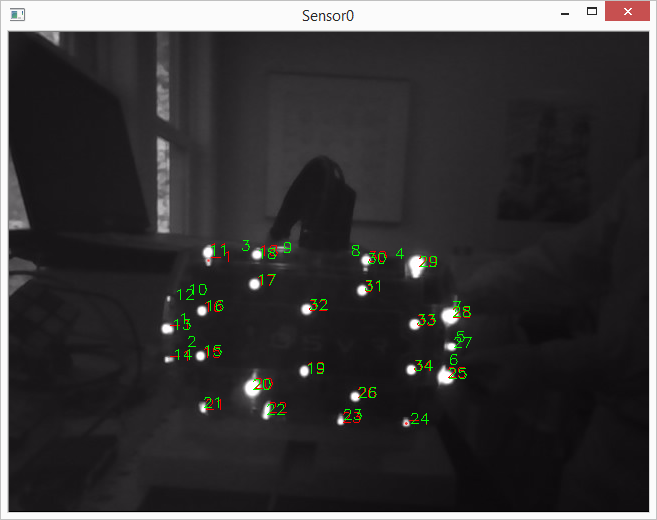
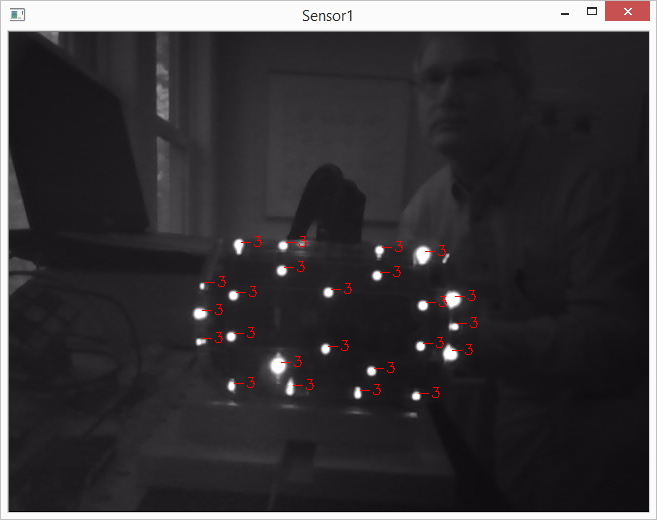
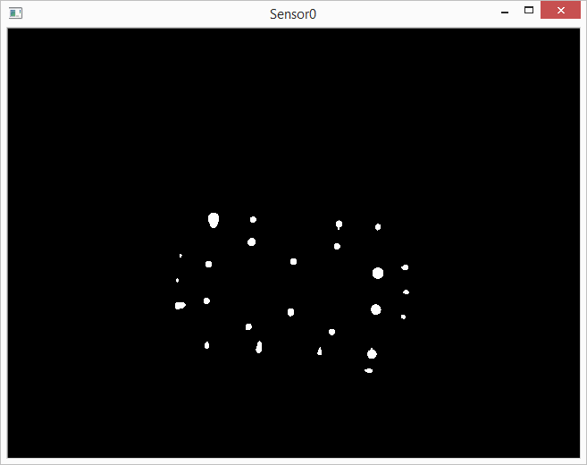

# Using the OSVR HDK's video-based tracker

This document describes how to use the OSVR HDK's video-based tracker, including how to plug in the camera and run a server that will use it.  See the [development document](./Developing.md) for how to develop new peripherals that would make use of the HDK camera to track objects in the scene.

## Set-up

The video-based tracking module uses a custom infrared camera that plugs into the server computer via USB  and into the HDK belt-pack via a phono connector.  It is run using using the standard OSVR server with a different configuration file that causes it to load a plug-in to do video-based tracking using the camera.

### Plugging in the unit

The camera ships with a small three-legged tripod that can be used to position and aim it at the field of view you want to track.  The tripod screws into the bottom of the camera and has a freely-rotating ball joint that can be tightened to point the camera.

First plug the USB cable, shipped with the HDK, into the micro-USB port on the side of the camera.  Then plug the USB cable into a free USB connector on the server computer.  Windows should recognize the camera as an imaging device and install it into the system.

Next, plug the phono cable that is attached to the power-supply connector into the camera.  Note: Be sure to plug the connector **all the way in** so that the edge of the connector is right up against the side of the camera.  The connector will go in easily most of the way and then snaps in after a final push.

Finally, plug the synchronizing power adapter.  This is shown disconnected in the image below.  The power adapter plugs into the left end of the cable and the right end of the cable plugs into the belt pack.  This inserts both power and the camera synchronization signal into the belt back, and from there into the HDK.  Plug the power adapter into the wall outlet to power the HDK and video-based tracking should be ready to go.

### Running the server

Once everything is plugged in, the standard OSVR server can be used to control it.  A special configuration file is required to tell the server to load the video-based tracking code.  On Windows, you can drag the file named *osvr_server_config.VideoBasedHMDTracker.sample.json* and drop it onto the *osvr_server.exe* program, or you can open up a Windows command shell and go to the directory where the server lives and then run the following:

    osvr_server.exe osvr_server_config.VideoBasedHMDTracker.sample.json

In the Cygwin shell and other Linux-like shells, you may need to explicitly tell it to us the one in the current directory.

    ./osvr_server.exe osvr_server_config.VideoBasedHMDTracker.sample.json

The server should report that it added a device named something like *com_osvr_VideoBasedHMDTracker/TrackedCamera0_0*, which it will automatically map to */me/head* in the OSVR semantic paths.

## Testing and debugging

Once everthing is plugged in and the server is running, you can use any client application to see how it is working.  One application we suggest you try that's handy for checking to make sure that things are working is called *Tracker Viewer*. On the [Using OSVR](http://osvr.github.io/using/) page, you'll see a download link for the OSVR Tracker Viewer. Download and run that (with the OSVR Server running!), and you'll get a small window with some 3D arrows in it. If you're 3D-graphics savvy or VR-savvy, you'll probably figure out what they are and what they mean, but the important part in general is to just verify that the small arrows in the middle move when you rotate the headset. (You can right-click and drag to zoom in to see it better)

### Debugging

If you want to see what is going on under the covers, or if you're not getting any tracker data and want to see what may be wrong, you can edit the osvr_server_config.VideoBasedHMDTracker.sample.json file (or make a new one and edit that) to change the *showDebug* parameter from *false* to *true*.  When you do this, two things happen:

* The locations of sensors will be printed to the console as they are found.  Only every 11th value will be printed.  The coordinate system is in meters and has +X to the right when looking from the camera's point of view, +Y down from the camera's point of view, and +Z forward from the camera's point of view.  The center of projection of the camera is the origin.

* A window will appear for each sensor showing video from the camera annotated by any available tracking information.  The contents of this window vary based on the state of the tracking system and based on keyboard commands.  Again, only every 11th frame is shown in each window.

If everything is working, you will see yellow numbers attached to the visible beacons on the HDK, as in the image below.

Each debug image shows red numbers indicating each beacon that has been identified in the 2D image.  When it has aquired a 3D estimate of the sensor, it overlays green numbers that are reprojections from the 3D space back into the 2D scene using the camera model.  When the camera model (or beacon location) is not completely accurate, there will be a slight misalignment between the red and green.  When they overlay well, red numbers will not be seen.

If there is not currently a model for the sensor, there will be no green numbers and only red numbers indicating beacons that have been seen.  If the beacon number is -1, this means that it has not been seen in enough consecutive frames to be identified.  If it is -3 it means that the code has been completely read but does not match any beacons for this sensor.  If there is more than one sensor window, each will have -3 beacons for beacons on other sensors, as with the window shown below.

#### Keyboard commands

Each of the debug windows responds to keyboard commands, letting you look in more detail at what is going on.  The setting describes above is the *beacon* setting, which is the default and is also what happens whenyou press **b**.  The *image* setting (**i**) shows the original image with no overlays.  The *threshold* setting (**t**) shows the thresholded image, from which the beacons are extracted.  An example threshold image is shown below.

## Coming Soon

Sensics is developing an analysis plug-in that will combine video + intertial tracker reports into a single tracker state that includes estimates on velocity and acceleration.

